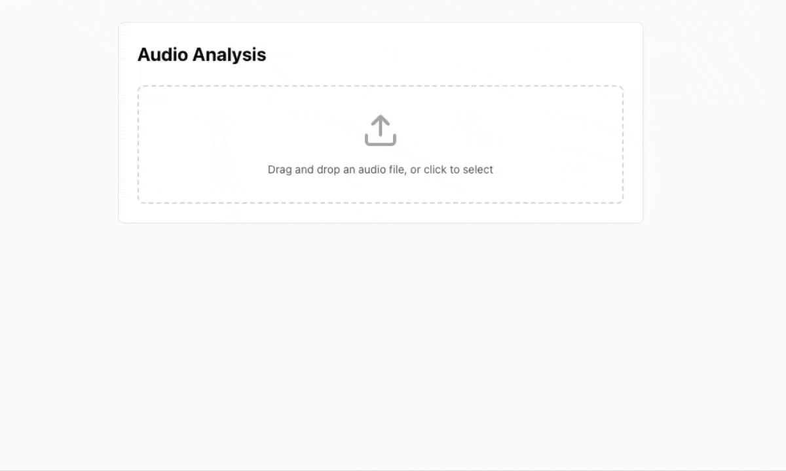

# AI MUSIC Detector from IRCAMAMPLIFY.IO

A simple web application that analyzes audio files to determine if they are AI-generated or human-created. The application provides comprehensive insights through IRCAM Amplify API integration and intelligent data processing.

## Features

- 🎵 Audio file upload and analysis
- 🤖 AI detection through IRCAM Amplify API
- 📈 Confidence score display

## Prerequisites

Before running the application, ensure you have the following installed:

- Node.js (v18 or later)
- IRCAM Amplify API credentials
  - You'll need to obtain `IRCAM_AMPLIFY_CLIENT_ID` and `IRCAM_AMPLIFY_CLIENT_SECRET` from [IRCAM Amplify](https://app.ircamamplify.io/api-credentials)

## Installation

1. Clone the repository:
```bash
git clone <repository-url>
cd audio-analysis-app
```

2. Install dependencies:
```bash
npm install
```

3. Create a `.env` file in the root directory with the following variables:
```env
# IRCAM API credentials
IRCAM_CLIENT_ID=your_client_id
IRCAM_CLIENT_SECRET=your_client_secret

# Environment (development/production)
NODE_ENV=development
```

## Running the Application

1. Start the development server:
```bash
npm run dev
```

2. Open your browser and navigate to:
```
http://localhost:5000
```

The application will be running with hot-reload enabled for both frontend and backend changes.

## Usage

1. **Upload Audio Files**
   - Drag and drop an audio file or click to select
   - Supported formats: MP3, WAV, OGG
   - Maximum file size: 10MB

2. **View Analysis Results**
   - AI detection result (AI Generated / Human Created)
   - Confidence score percentage

## API Endpoints

### GET /api/check-upload
Checks the upload status.

Response:
```json
{
  "hasUploaded": boolean
}
```

### POST /api/upload
Uploads and analyzes an audio file.

Request:
- Method: POST
- Content-Type: multipart/form-data
- Body: Form data with 'audio' file

Response:
```json
{
  "ISAI": boolean,
  "confidence": number
}
```

## Tech Stack

- TypeScript (Full-stack)
- Express.js backend
- React + Vite frontend
- Tailwind CSS + shadcn/ui
- IRCAM Amplify API for audio analysis

## Development Guidelines

1. Environment Variables
   - Make sure to set up IRCAM AMPLIFY API credentials in your environment

2. API Integration
   - All IRCAM AMPLIFY API calls are handled on the backend
   - Proper error handling is implemented


## Environment Variables Setup

1. First, create your local `.env` file by copying the example:
```bash
cp .env.example .env
```

2. Open the `.env` file and fill in your credentials:
```env
# IRCAM Amplify API credentials
# Get these from https://app.ircamamplify.io/api-credentials
IRCAM_CLIENT_ID=your_client_id_here
IRCAM_CLIENT_SECRET=your_client_secret_here

# Environment configuration
NODE_ENV=development

# Optional: Set a custom port (default: 5000)
PORT=3000  # Uncomment and change if you want to use a different port
```

## Production Deployment

1. Build the application:
```bash
npm run build
```

2. Set the environment variables:
   - Set `NODE_ENV=production`
   - Set IRCAM API credentials

3. Start the production server:
```bash
npm start
```

## Error Handling

The application includes comprehensive error handling for:
- Invalid file types
- File size limits
- API integration failures
- Network connectivity issues

## Contributing

1. Fork the repository
2. Create your feature branch
3. Commit your changes
4. Push to the branch
5. Create a new Pull Request

## License

This project is licensed under the MIT License - see the LICENSE file for details.

## Common Issues & Solutions

### Environment Variables Not Loading

If your environment variables aren't loading:

1. Make sure you're running the application from the project root directory
2. Verify that your `.env` file exists and is in the root directory
3. Check the console output for "Environment Variables Status" when starting the server
4. Ensure there are no spaces around the `=` in your .env file

### CORS Issues in Local Development

The application is configured to allow CORS for both port 3000 and 5000 in development mode. If you're still experiencing CORS issues:

1. Check that `NODE_ENV=development` is set in your `.env` file
2. Verify you're accessing the API from either:
   - http://localhost:3000
   - http://localhost:5000

### Custom Port Configuration

To use a custom port:

1. Add `PORT=your_port_number` to your `.env` file
2. The server will automatically use this port instead of the default 5000

## Verifying Setup

After setting up your environment:

1. Start the development server:
```bash
npm run dev
```

2. Check the console output for:
   - Environment Variables Status message
   - CORS configuration message
   - Server port confirmation

If you see any "MISSING" variables in the Environment Variables Status, ensure they are properly set in your `.env` file.
